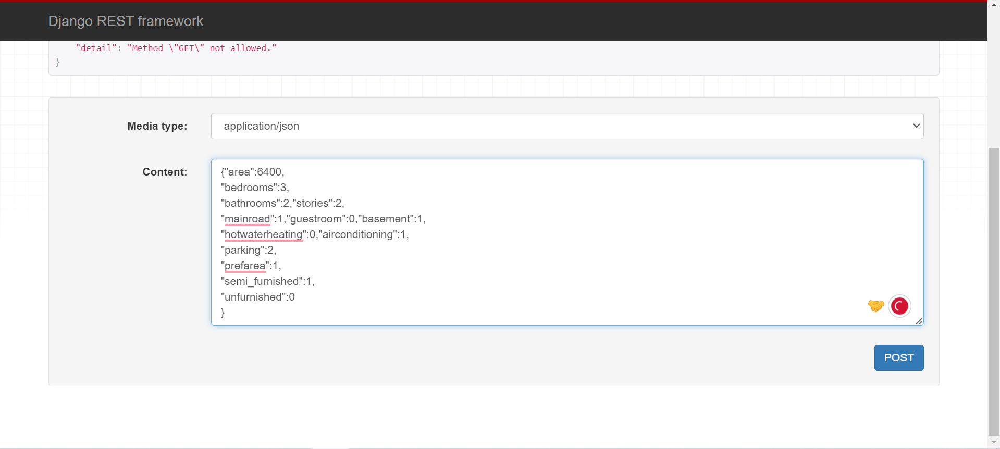
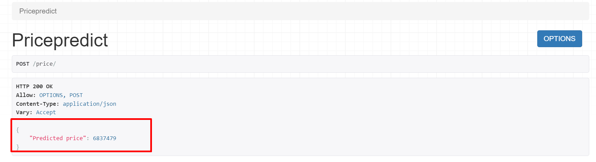

# API for house price prediction
This project aims to develop a web application for predicting house prices using machine learning algorithms and Django REST API. The application allows users to input various features of a house, such as the number of bedrooms, bathrooms, square footage area, stories,how water heating, air conditioning, parking, prefarea, furnishing status and basement area, and predicts the price of the house based on these inputs.

## How it Works
The user provides input data about the house, including thethe number of bedrooms, bathrooms, square footage area, stories,how water heating, air conditioning, parking, prefarea, furnishing status and basement area.
The input data is sent to the Django REST API.
The Django REST API uses the trained machine learning model to predict the price of the house based on the input data.
The predicted house price is returned to the user through the API response.

## How to install and use
1. Clone the repository from GitHub using the following command:
git clone https://github.com/palisthadeshar/House-Price-Prediction-using-LinearRegression-and-Django-Rest-API.git

2. Change the directory to the repository:
cd House-Price-Prediction-using-LinearRegression-and-Django-Rest-API

3. Create a virtual environment:
python -m venv env

4. Activate the virtual environment:
source env/bin/activate

5. Install the dependencies:
pip install -r requirements.txt

6. Migrate the Django project:
python manage.py migrate

7. Run server:
py manage.py runserver

Then open http://127.0.0.1:8000// on web browser. Enter the input data and click on predict. 

To use Django default REST FrameWork open http://127.0.0.1:8000/price/. Input data in JSON format and click on post.

